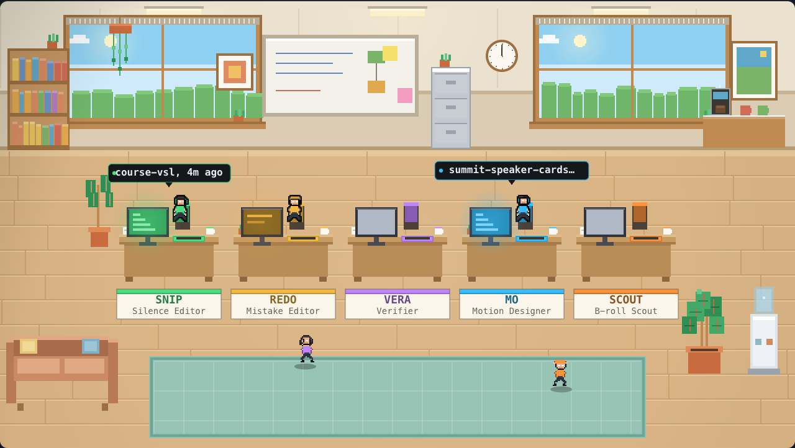
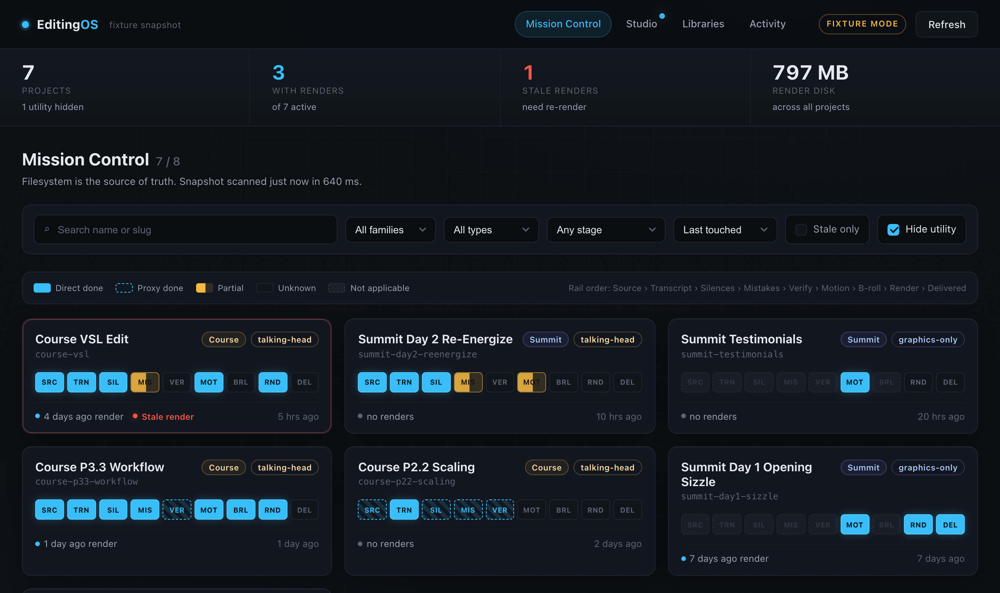

# Editing OS

Five AI agents that edit your talking-head videos, and an 8-bit office where you watch
them work.



Drop in a raw recording. Snip cuts the silence, Redo cuts the mistakes, Vera proves the
cuts landed, Mo adds the motion graphics, Scout adds the b-roll. Every destructive step
asks you first.

It runs locally on your machine. No subscription, no upload, no cloud render queue.

## Why it's different

Most auto-editors gate on volume and hope. This one is **transcript-driven**: a word-level
transcript is produced once, and every decision downstream is timed off those word
timestamps. That's why the cuts land on syllables instead of near them.

Two things it does that other tools don't:

- **The retake read.** After the first clean render, `cut-mistakes` re-transcribes and
  reads the whole transcript editorially to piece together your best take of every
  re-recorded sentence. A mechanical detector alone catches a small fraction of real
  retakes. If you re-record lines while shooting, this is the step that saves you.
- **A verification agent.** `verify-cuts` re-transcribes the *rendered file* and makes
  three full passes to prove every approved cut actually landed. It can fail, and failures
  route back to the editors. Nothing ships on the assumption that ffmpeg did what it was told.

## Quickstart

```bash
git clone <your-fork-url> editing-os && cd editing-os
npm install
brew install whisper-cpp  # local transcription, no API key needed (Windows: see below)
cp .env.example .env      # optional keys only (b-roll providers)
npx hyperframes doctor    # checks Node, FFmpeg, Chrome
npm run os                # dashboard on http://localhost:4200
```

**Windows:** install Node, FFmpeg, Chrome and Python with `winget` (`OpenJS.NodeJS.LTS`,
`Gyan.FFmpeg`, `Google.Chrome`, `Python.Python.3.12`), then unzip `whisper-bin-x64.zip` from the
[whisper.cpp releases](https://github.com/ggml-org/whisper.cpp/releases) and put its `Release\`
folder on your PATH (or set `WHISPER_CLI=<path to whisper-cli.exe>`). Or let
`scripts\setup_windows.bat` do all of that in one double-click. Then double-click
`editing-os\Editing OS.bat` to start the dashboard. Step by step in `LISEZMOI.md` § 2 bis.

Then open Claude Code in this folder and say:

```
cut the silences out of video-projects/my-video/assets/raw.mp4
```

**Prerequisites:** Node 20+, FFmpeg, Chrome, and
[whisper-cpp](https://github.com/ggerganov/whisper.cpp) (`brew install whisper-cpp`).
Transcription runs locally, so no API key is needed — the whisper model downloads itself
to `models/` on first use. An [ElevenLabs](https://elevenlabs.io) key is optional and only
enables the hosted transcriber fallback.

## The agents

| Agent | Skill | Does |
| --- | --- | --- |
| **Snip** | `cut-silences` | Trims pauses and dead air off word timestamps |
| **Redo** | `cut-mistakes` | Stutters, false starts, repeats, and retakes |
| **Vera** | `verify-cuts` | Re-transcribes the render, proves every cut landed |
| **Mo** | `motion-graphics` | Tiered cards from an 8-style library |
| **Scout** | `insert-broll` | Cutaways, screenshots, logos, stock footage |

Snip, Redo, and Scout are review-gated. They propose each change with context and a
reason, and nothing renders until you approve.

## The dashboard

```bash
npm run os     # http://localhost:4200
```



The filesystem is the only source of truth. No database, no build step, Node builtins
only. It scans your projects and shows a 9-stage pipeline rail per video, so you can see
at a glance which videos are stuck and where.

The **Studio** view is the 8-bit office. It reads real file mtimes: an agent shows as
working for 15 minutes after its stage writes an artifact, winds down for 2 hours, then
goes idle and strolls around. Empty desks are colored to their owner, so you can tell
who's out.

Force any state for demos and screenshots:

```
#/studio?force=silences:working,motion:working
#/studio?fixture=1            # standalone, no server needed
```

## What's inside

```
.claude/skills/     the agents, plus HyperFrames and GSAP references
editing-os/         the dashboard
style-library/      8 motion-graphic card styles, 1600+ cards
style-templates/    starting looks for new projects
asset-library/      local b-roll / logo / screenshot database
scripts/            transcribe, validate, preflight
```

Motion graphics are built on [HyperFrames](https://hyperframes.heygen.com), which is
HTML-native video. Cards are real HTML and CSS, so you can restyle anything by editing a
stylesheet instead of fighting a timeline.

## Read these two files

- **`CLAUDE.md`** — the workspace guide. The render contract and the authoring gates live
  here. Claude reads it automatically.
- **`MOTION_PHILOSOPHY.md`** — the motion-graphics aesthetic. Read it before any creative
  session.

## Notes and limits

- macOS is the original, battle-tested path. Windows support (launcher, `python`/`npx`/`whisper-cli`
  lookup, Recycle Bin, Explorer reveal) was added on 2026-09-05 and validated on Linux plus code
  review, not yet on a Windows machine. Platform differences live in `scripts/lib/platform.mjs`.
- B-roll (Scout) is the newest agent and the least battle-tested of the five.
- `verify-cuts` has no direct on-disk artifact yet, so the dashboard infers it from a clean
  render. If a `verify-report.md` lands it gets picked up as direct evidence automatically.
- The style library ships without preview posters to keep the clone small. Regenerate them
  from the cards whenever you want them.

## License

MIT. Do whatever you want with it. If it saves you an afternoon in a timeline, that was
the point.
